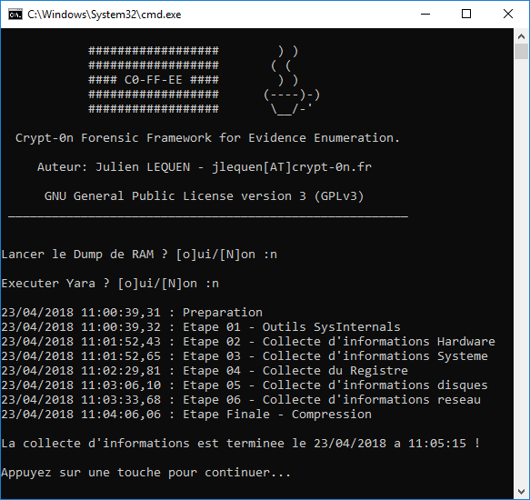

# C0-FF-EE

## Présentation

C0-FF-EE est l'acronyme de : Crypt-0n Forensic Framework for Evidence Enumeration

Cet outil a pour but de collecter des informations d'une machine Windows afin de faciliter la réponse à incident de sécurité.

## Utilisation

Exécutez `Run.bat`

Vous pouvez utiliser des règles Yara perso en les ajoutant dans le fichier `bin\rules.yar`